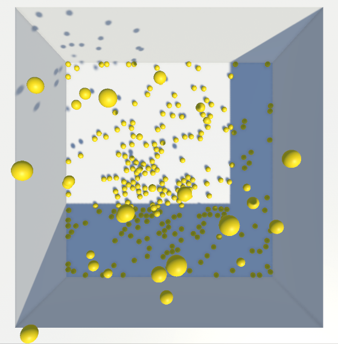
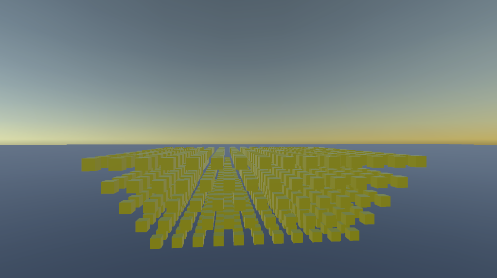
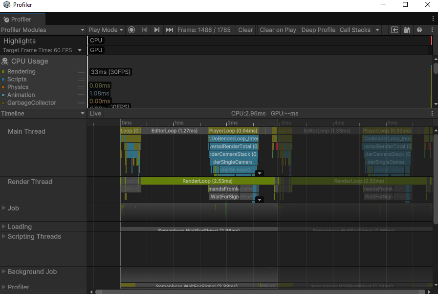
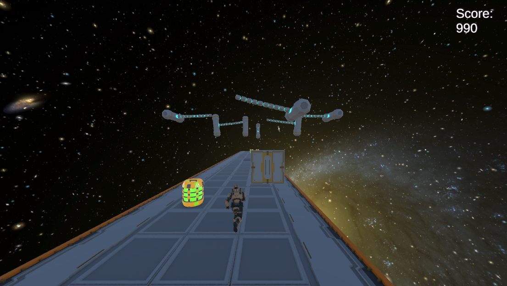

+++
title = 'Game Engine Vergleich'
date = 2024-09-28T15:40:23+02:00
draft = false
weight = 600

+++

Hier soll der gesamte Artikel zusammengeführt werden. 

Ein Beispiel-Bild:

## Einleitung
Die Wahl der richtigen Game-Engine spielt eine entscheidende Rolle bei der Entwicklung von Computerspielen und beeinflusst sowohl die Effizienz des Arbeitsprozesses als auch die Qualität des Endprodukts. In diesem Bericht untersuchen wir drei der bekanntesten und am weitesten verbreiteten Game-Engines: Godot, Unreal Engine und Unity. Durch eine detaillierte Analyse möchten wir ihre Eigenschaften sowie die dazugehörigen Stärken und Schwächen aufzeigen, um Entwicklern und Interessenten eine fundierte Entscheidungsgrundlage zu bieten.
   
### Ziel der Analyse
Die Analyse konzentriert sich auf zentrale Aspekte wie Benutzerfreundlichkeit, technische Leistungsfähigkeit, Tool-Unterstützung und die Entwicklungsumgebung. Darüber hinaus spielt die Eignung der Engines für bestimmte Projekte – wie zum Beispiel das Entwickeln von Spielen, Simulationen, Software etc. – eine wesentliche Rolle. Neben der theoretischen Bewertung stellen wir daher auch praktische Erfahrungen vor, um einen praxisnahen Einblick in die Stärken und Schwächen der Engines zu geben. Unsere Ergebnisse sollen sowohl für professionelle Entwicklerteams als auch für Einzelpersonen nützlich sein, die sich in der Planung oder Umsetzung ihrer Projekte befinden. Durch die Ergebnisse unserer Arbeiten, möchten wir nicht nur technische Unterschiede aufzeigen, sondern auch Empfehlungen geben, welche Engine sich für spezifische Anwendungen und Anforderungen besonders eignet. Ziel ist es, einen umfassenden und zugleich verständlichen Überblick zu bieten, der eine informierte Entscheidung ermöglicht.

### Methodik
Um die Leistungsfähigkeit und Benutzerfreundlichkeit verschiedener Game Engines zu analysieren, haben wir zwei verschiedene Verfahren angewendet. Dieses umfasst sowohl objektive, messbare Tests als auch subjektive Erfahrungsberichte, die während der Entwicklung eines Beispielprojekts gewonnen wurden. Ziel ist es, die Stärken und Schwächen der Engines zu evaluieren und eine fundierte Grundlage für Empfehlungen bereitzustellen. Dabei haben wir zum Einen verschiedene objektive Tests nach bestimmten Kategorien durchgeführt und zum Anderen ein Beispielprojekt in Form eines Endless Runner entiwckelt. Die Kategorien waren: 

**Physik-Benchmark:**
	Ein rechteckiges Becken (20 × 20 Meter) wird kontinuierlich mit Kugeln gefüllt, die pro Sekunde nacheinander instanziiert werden. Die Simulation wird beendet, sobald die Frame-Time (Delta) 100 ms überschreitet, was einer Framerate von ≤ 10 FPS entspricht. Das Messergebnis gibt an, wie viele Kugeln instanziiert werden konnten, bevor die Leistungsgrenze erreicht wurde.

Der Szenenaufbau beinhaltet:
- Beckenabmessungen: 20 × 20 Meter.
- Kugelradius: 0,05 Meter (Durchmesser: 0,1 Meter).
- Kameraposition: Senkrecht über dem Becken zentriert.
- Kamera-Öffnungswinkel: 60°.
- Kameraabstand: So gewählt, dass das Becken den oberen und unteren Bildschirmrand vollständig ausfüllt.

**Grafik-Benchmark:**
	Zur Überprüfung der Grafikleistung wird ein Turm aus Blöcken schrittweise aufgebaut. Dabei wird in jeder Iteration das Grid um eine Spalte und eine Reihe vergrößert, wodurch die Gesamtanzahl der Blöcke exponentiell ansteigt. Eine Kamera, die um den Mittelpunkt des Turms rotiert, stellt sicher, dass möglichst viele Flächen gerendert werden. Der Test endet, wenn die Frame-Time 100 ms überschreitet. Das Messergebnis gibt an, wie groß der Turm (in Blockanzahl) wird, bevor die Leistungsgrenze erreicht wird.

Der Szenenaufbau beinhaltet:
- Die Kamera bleibt zentriert auf den Turm ausgerichtet und rotiert um diesen herum.
- Turm wird pro Iteration um eine Spalte und Reihe vergrößert

Die Benchmarks wurden mit der folgenden Hardware getestet:

#### CPU
- **Modell:** 12th Gen Intel® Core™ i9-12900H  
- **Taktfrequenz:** 2,9 GHz  
- **Kerne:** 14  
- **Logische Prozessoren:** 20  
- **Arbeitsspeicher:** 32 GB RAM  

#### GPU
- **Modell:** NVIDIA GeForce RTX 3080 Ti (Laptop)  
- **Videospeicher:** 16 GB GPU-RAM  

#### Bildschirmauflösung
- **Auflösung:** 2560 × 1600  

Neben den Benchmarks wurde ein Endless-Runner-Spiel entwickelt, um die Engines unter praxisnahen Bedingungen zu testen. Das Projekt umfasst wesentliche Spielelemente wie prozedural generierte Levelabschnitte und verschiedene Gameplay Mechaniken wie Laufen und Springen.

Die Entwicklung des Projekts diente dazu, qualitative Eindrücke über die Benutzerfreundlichkeit, die Arbeitsabläufe und die Lernkurve der jeweiligen Engines zu sammeln. Aspekte wie die Zugänglichkeit der Dokumentation, die Effizienz der Entwicklungsumgebung und die Eignung der Engines für ein prozedurales Spiel wurden hierbei bewertet.
Die gewonnenen Ergebnisse aus den Benchmarks und der Entwicklung des Endless Runners wurden miteinander kombiniert, um eine ganzheitliche Bewertung zu ermöglichen. Damit konnten sowohl die technische Leitungs, als auch die praktischen Vor- und Nachteile geschickt erfasst werden.

Mit diesem Verfahren wird sicher gesellt, dass die Analyse sowohl fundierte, datenbasierte Einblicke bietet, als auch die Erfahrungen der Teams und der tatsächlichen Entwicklung berücksichtigt.

## Unity

### Die Engine

Unity bietet verschiedene Lizenzmodelle an, darunter kostenlose und kostenpflichtige Versionen. Eine Runtime-Gebühr wurde angekündigt, jedoch nach massiven Beschwerden der Community wieder verworfen.
         
Zum einen gibt es die "Personal"-Version, also die kostenfreie Version. Diese ist ideal für Einsteiger, da selbst kein Geld investiert werden muss und trotz allem die grundlegenden Funktionen wie Echtzeit-Entwicklung, Startbildschirm-Anpassung und der Unity Asset Manager verfügbar sind.

Die Pro-Version ist ab 1.877€ im Jahr erhältlich und eignet sich für profesionelle Entwickler. Es werden zusätzliche Features wie ein erweiterter Langzeit-Support und ein größerer Asset Manager angeboten.

"Enterprise" ist auf große Teams und Firmen ausgerichtet. Diese Version umfasst Pro-Features und zusätzliche Optionen wie Build-Server-Lizenzen und einen vollen Zugriff auf den Quellcode. 

Bei der Industry-Lizenz ist der Fokus auf Unternehmen in spezifischen Branchen gelegt und es werden branchenspezifische Toolkits angeboten.

Unity ist vor allem für 2D- und VR-Anwendungen weit verbreitet. Dank einer starken Community bietet die Engine zahlreiche Ressourcen, die den Einstieg und die Weiterentwicklung erleichtern. 
Die offizielle [Unity-Dokumentation](https://docs.unity3d.com/Manual/index.html) bietet eine umfassende Übersicht über die Funktionen und Möglichkeiten der Engine. Für Einsteiger und Fortgeschrittene gibt es zudem [Unity Learn](https://learn.unity.com/). Zusätzlich kann über Youtube, Reddit und anderen Plattformen viele Anleitungen und Tipps gefunden werden. Wer allerdings gezielte Unterstützung sucht, kann im [Unity-Forum](https://discussions.unity.com/) und Plattformen wie Reddit nach Hilfe fragen.

### Benutzerfreundlichkeit, Usability
Die Benutzeroberfläche von Unity ist übersichtlich gestaltet und bietet eine Vielzahl an Werkzeugen, die eine flexible Anpassung an unterschiedliche Projekte ermöglichen. Für Einsteiger kann die Fülle an Funktionen anfangs überwältigend wirken, doch dank umfangreicher Tutorials kann der Einstieg immens erleichtert werden.
Ein gutes Beispiel ist das Partikelsystem. Mit einer Anleitung konnte etwa ein explodierendes Fass problemlos erstellt werden, während es ohne Tutorial aufgrund der zahlreichen Parameter und Optionen deutlich schwieriger gewesen wäre. Die hohe Flexibilität und Anpassungsfähigkeit der Engine sind beeindruckend, gehen jedoch mit einer gewissen Lernkurve einher.

### Programmierumgebung, Tools
Unity verwendet C# als Programmiersprache und unterstützt gängige IDEs wie Visual Studio, Visual Studio Code und Rider. Auch Debugging und Profiling sind mit den integrierten Tools realisierbar. Diese ermöglichen detaillierte Analysen, wie z.B. die Nutzung des Profilers zur Überprüfung der Frame-Time.
    
Zusätzlich wird Visual Scripting unterstützt, wobei diese Methode weniger verbreitet ist als herkömmliches C#-Scripting. Dennoch bietet sie eine Möglichkeit für Entwickler ohne tiefgehende Programmierkenntnisse, ihre Spiele mechanisch zu erweitern.

### Grafikqualität
Die visuelle Darstellung in Unity hängt maßgeblich von der gewählten Renderpipeline ab. Die Built-in Render Pipeline ist die Standardlösung, die eine solide Basis bietet, jedoch in ihrer Leistungsfähigkeit für moderne Effekte begrenzt ist. Eine optimierte Alternative stellt die Universal Render Pipeline (URP) dar, die besonders für mobile Geräte und leistungsschwächere Plattformen entwickelt wurde, ohne dabei auf eine ansprechende Grafikqualität zu verzichten. Wer realistische visuelle Effekte erzielen möchte, kann auf die High Definition Render Pipeline (HDRP) setzen, benötigt dafür jedoch leistungsstarke Hardware.

In unserem Endless-Runner-Projekt mit prozedural generierten Levels überzeugte Unity mit flüssigen Übergängen und einer ansprechenden Darstellung. Die Engine ermöglicht zahlreiche Anpassungen für Shader und visuelle Effekte, sodass Entwickler die Grafikqualität gezielt anpassen und optimieren können.

### Character Animation
Unity bietet mit dem Animator ein leistungsstarkes Tool zur Steuerung von Animationen. Die State-Machine ermöglicht komplexe Übergänge zwischen Animationen, wobei Übergangszeiten und Bedingungen individuell angepasst werden können.

Bei der Nutzung von Mixamo für Charakteranimationen stellte sich heraus, dass Mixamo keinen direkten Export von Animationen erlaubt. Die Lösung bestand darin, die Animationen aus dem Import in Unity zu extrahieren und anschließend im Animator zu verwenden.
Das Ragdoll-System von Unity bietet zwar eine solide Grundlage für physikbasierte Animationen, weist jedoch einige Einschränkungen auf. Es gibt keine automatische Erkennung von Bones, was das manuelle Setup erfordert. Zudem ist ein nahtloser Übergang zwischen Animation und Ragdoll-Physik nicht direkt möglich. Dieses Problem konnte mit einem Ragdoll-Enabler-Skript aus einem [YouTube-Tutorial](https://www.youtube.com/watch?v=RB18IyKZiB0) behoben werden.

### Lernkurve
Dank der umfassenden Ressourcen wie Unity Learn und der großen Community gestaltet sich der Einstieg in Unity relativ einfach. Für fortgeschrittene Themen, etwa das Partikelsystem oder Animationen, sind jedoch oft zusätzliche Tutorials erforderlich. 
Insgesamt bietet Unity eine moderate Lernkurve, wobei die hohe Anzahl an Funktionen eine gewisse Einarbeitungszeit erfordert.

### Probleme & Lösungen, Eigenheiten
Beim Import von 3D-Modellen traten Probleme auf, insbesondere beim Importieren von .blend-Dateien ohne installiertes Blender. Zudem war das manuelle Extrahieren und Zuweisen von Texturen erforderlich. Eine effektive Lösung bestand darin, stattdessen .fbx-Dateien zu verwenden, um den Workflow reibungsloser zu gestalten.

Im Bereich der Ragdolls zeigte sich, dass die automatische Erkennung von Bones nicht zuverlässig funktioniert, was ein manuelles Setup notwendig machte. Außerdem ist der Übergang von Animationen zu Ragdoll-Physik nicht nativ möglich. Dieses Problem konnte jedoch durch den Einsatz eines Ragdoll-Enabler-Skripts behoben werden.

Bei der Arbeit mit Mixamo-Animationen stellte sich der Export mehrerer Animationen als problematisch heraus. Die Lösung bestand darin, die Animationen manuell zu extrahieren und sie anschließend in den Animation Controller einzubinden.

### Gesamteindruck
Unity ist eine äußerst vielseitige Engine mit einer breiten Palette an Funktionen, die sowohl für Anfänger als auch für erfahrene Entwickler geeignet ist. Besonders hervorzuheben sind die starke Community und die umfangreiche Dokumentation, die den Einstieg erleichtern und bei Problemen schnell Lösungen bieten.

Für unser Endless-Runner-Projekt erwies sich Unity als eine ausgezeichnete Wahl, da die Engine prozedurale Levelgenerierung, komplexe Animationen und leistungsfähige Grafikpipelines unterstützt. Trotz einiger Herausforderungen, insbesondere beim Import von 3D-Modellen und Animationen, konnten diese Probleme durch gezielte Lösungen bewältigt werden. Die anschließende Erstellung der Web-Anwendung war überraschend einfach. Dank der benutzerfreundlichen Tools und mithilfe dieses [Youtube-Tutorials](https://www.youtube.com/watch?v=X8Njwk4IRo0) konnte einfach und schnell eine Web-Anwendung erstellt werden.

Mit diesem Link kann die Anwenung selbst getestet werden: [Endless Runner Unity](https://play.unity.com/en/games/8c5831da-319c-47af-a985-51e2100a43b4/webbuild).

Unity bietet eine starke Basis für verschiedenste Projekte und bleibt eine der führenden Engines für die Spielentwicklung. Entwickler, die bereit sind, sich in die Vielzahl der Funktionen einzuarbeiten, können mit Unity beeindruckende Ergebnisse erzielen.

## Unreal

## Überblick
Die Unreal Engine 5 (UE5), entwickelt von Epic Games, ist eine der leistungsstärksten Spiele-Engines auf dem Markt. Sie ist bekannt für ihre beeindruckenden High-End-Rendering-Fähigkeiten und professionellen Tools, die von AAA-Studios und Indie-Entwicklern gleichermaßen genutzt werden. UE5 unterstützt eine Vielzahl von Plattformen, darunter PC, Konsolen, mobile Geräte sowie VR/AR. Zu den herausragenden Features gehören:

- **Lumen:** Dynamische globale Beleuchtung in Echtzeit.
- **Nanite:** Virtualisierte Geometrie, die hochdetaillierte Umgebungen effizient darstellt.
- **Chaos Physics:** Fortschrittliche Physik-Engine für realistische Simulationen.

Offizielle Website: [Unreal Engine](https://www.unrealengine.com)

## Lizenzmodell
- **Kosten:** Die Unreal Engine ist grundsätzlich kostenlos nutzbar. Epic Games erhebt jedoch eine Umsatzbeteiligung von 5 %, wenn der Jahresumsatz eines Titels 1 Million USD überschreitet.
- **Epic Games Store:** Für Umsätze, die über den Epic Games Store generiert werden, entfällt die Lizenzgebühr.
- **Flexibilität:** Besonders attraktiv für Indie-Entwickler, da keine Vorabkosten anfallen. Größere Studios können individuelle Verträge aushandeln.

Weiterführende Informationen: [Unreal Engine Lizenzmodell](https://www.unrealengine.com/en-US/release)

## Verbreitung und Community
Die Unreal Engine ist sowohl in der AAA-Spieleentwicklung als auch bei Indie-Entwicklern weit verbreitet. Beispiele für bekannte Spiele sind **Fortnite**, **Gears of War** und **Final Fantasy VII Remake**. 

### Community und Ressourcen:
- **Foren und Discord-Gruppen:** Sehr aktiv und hilfreich für Problemlösungen und Feedback.
- **YouTube-Tutorials und Online-Kurse:** Eine große Auswahl an kostenlosen und kostenpflichtigen Lernressourcen.
- **Unreal Marketplace:** Umfangreiche Bibliothek an Plugins, Assets und Tools.

Nützliche Links:
- [Unreal Engine Forum](https://forums.unrealengine.com)
- [Unreal Engine Marketplace](https://www.unrealengine.com/marketplace)
- [YouTube-Tutorials für UE5](https://www.youtube.com/results?search_query=unreal+engine+5+tutorial)

## Benutzerfreundlichkeit und Usability

### Editor-Oberfläche
Die Editor-Oberfläche der Unreal Engine ist modular aufgebaut und bietet intuitive Panels wie den Content Browser, das Details Panel und den Blueprint Editor. Sie ist mächtig und anfangs etwas überwältigend, aber logisch strukturiert.

### Blueprints
- **Visuelles Scripting-System**, das ohne Programmierkenntnisse genutzt werden kann.
- Ideal für Prototyping und einfache Mechaniken.
- **Empfohlener Einstieg:** [Blueprint Visual Scripting Dokumentation](https://docs.unrealengine.com/5.0/en-US/blueprints-visual-scripting-in-unreal-engine/)

### Workflow
- **Hot Reload:** Änderungen im Code können sofort im Editor getestet werden.
- **Projektvorlagen:** FPS, Third Person, Side Scroller und weitere Vorlagen erleichtern den Einstieg.

## Programmierumgebung und Tools
- **Programmiersprachen:** Unterstützung für C++ und Blueprints.
- **IDE-Integration:** Nahtlose Integration mit Visual Studio, Rider und Xcode.
- **Debugging und Profiling:** Tools wie **Unreal Insights** und eingebaute Debug-Funktionen in Blueprints.

### Teamarbeit
- **Version Control:** Unterstützung für Git und Perforce.
- **Herausforderungen:** Bei binären Assets (UAssets) können Merge-Konflikte auftreten.

Nützliche Tools:
- [Unreal Insights](https://docs.unrealengine.com/5.0/en-US/unreal-insights-overview-in-unreal-engine/)

## Grafikqualität
- **Lumen und Nanite:** Revolutionieren das Rendering und ermöglichen realistische Beleuchtung und detaillierte Umgebungen.
- **Post-Processing:** Effekte wie Bloom, Depth of Field und Motion Blur.
- **Skalierbarkeit:** Einstellbare Qualität für verschiedene Hardware-Anforderungen.

### Beispiel:
Eine fotorealistische Landschaft mit Nanite und Lumen:
- [Landschaftserstellung mit Nanite und Lumen](https://www.youtube.com/watch?v=1NKOiLrX4r8)

## Charakteranimation
- **Animationssystem:** Umfassend mit State Machines, Inverse Kinematik und Layered Animation.
- **Tools:** Full Body IK (UE5) und Layered Animation ermöglichen präzise Steuerung.
- **Asset-Import:** Unkomplizierter Import von Animationen, z. B. von Mixamo.

### Nützliche Ressourcen:
- [Unreal Engine Animation Dokumentation](https://docs.unrealengine.com/5.0/en-US/animation-blueprint-in-unreal-engine/)

## Lernkurve und Einstieg
- **Schwierigkeit:** Der Einstieg kann komplex sein, besonders wegen der Vielzahl an Funktionen.
- **Blueprints:** Ideal für Einsteiger ohne Programmierkenntnisse.
- **C++ und APIs:** Für fortgeschrittene Entwickler wichtig, um das volle Potenzial der Engine auszuschöpfen.
- **Ressourcen:** Umfangreiche Tutorials, Beispielprojekte und die offizielle Dokumentation.

### Empfehlenswerte Tutorials:
- [Endless Runner Tutorial (YouTube)](https://www.youtube.com/results?search_query=unreal+engine+endless+runner+tutorial)
- [Offizielle Unreal Engine Dokumentation](https://docs.unrealengine.com)

## Erfahrungsbericht: Erstellung eines Endless Runners

### Projektplanung und Konzeptualisierung
- **Spielmechanik:** Der Spieler läuft automatisch und muss durch Springen oder Ducken Hindernisse überwinden.
- **Thema und Design:** Festlegung des grafischen Stils, z. B. futuristisch oder Cartoon-artig.

### Erstellung der Spielmechanik
- **Blueprints:** Ideal, um die grundlegende Bewegung und Kollisionsabfragen zu realisieren.
- **Level-Streaming:** Endlose Level durch modulare Abschnitte und zufälliges Spawn von Hindernissen.

### Beispiel-Assets und Ressourcen:
- [Endless Runner Starter Kit](https://www.unrealengine.com/marketplace/en-US/product/endless-runner-starter-kit)
- [Beispielprojekt: Side Scroller](https://docs.unrealengine.com/5.0/en-US/side-scroller-template-in-unreal-engine/)

## Probleme, Lösungen und Eigenheiten
- **Binäre Assets:** Merge-Konflikte bei UAssets können die Zusammenarbeit in Teams erschweren.
- **Hardware-Anforderungen:** Für Lumen und Nanite sind leistungsstarke GPUs erforderlich.
- **Komplexität:** Die Vielfalt an Features kann Neulinge überfordern.

### Lösungen:
- **Virtual Assets** zur Verbesserung von Versionskontrollproblemen.
- **Performance-Optimierungen** für mobile Geräte, z. B. durch Anpassungen in den Rendering-Einstellungen.

## Gesamteindruck
Die Unreal Engine überzeugt durch ihre herausragende Grafikqualität, vielseitige Tools und professionelle Funktionalität. Trotz der anfänglichen Komplexität erleichtern umfangreiche Tutorials, Blueprints und Community-Ressourcen den Einstieg. Besonders für ambitionierte Projekte geeignet, bietet die Engine aber auch eine solide Grundlage für kleinere Vorhaben.

## Godot

### Die Engine
Die Godot Engine, welches 2014 veröffentlicht wurde, ist eine MIT - lizensierte Open-Source Engine. Die MIT-Lizenz erlaubt es die Software frei zu nutzen, zu modifizieren und zu verteilen, solange der ursprüngliche Lizenztext beibehalten wird. Sie bietet zudem keinen Haftungsausschluss für Schäden. Godot wird von einer aktiven Community sowie einem Kernteam kontinuierlich weiterentwickelt. Godot unterstützt sowohl 2D- als auch 3D-Spieleentwicklung, wobei der Fokus besonders auf der 2D- Performance liegt, allerdings gab es bereits schon wesentliche Fortschritte im 3D - Bereich. Die Engine bietet eine umfassende Plattformunterstützung und erlaubt die Veröffentlichung von Spielen auf Windows, macOS, Linux, Android, iOS und Konsolen. Ein Alleinstellungsmerkmal von Godot ist das integrierte Szenensystem, das Spielelemente hierarchisch organisiert und den Entwicklungsprozess stark vereinfacht.

### Benutzerfreundlichkeit, Usability
Godot zeichnet sich durch eine intuitive Benutzeroberfläche und ein klar strukturiertes Layout aus, das sowohl für Einsteiger als auch für erfahrene Entwickler leicht verständlich ist. Besonders die Drag- and-Drop-Funktionalität und der Node-basierte Aufbau tragen dazu bei, dass die Engine schnell erlernt werden kann. Tutorials und Dokumentationen sind gut verfügbar, wobei die Community eine Vielzahl zusätzlicher Ressourcen bereitstellt. Ein Nachteil könnte jedoch die kleinere Community im Vergleich zu Unity oder Unreal darstellen, was die Verfügbarkeit spezifischer Plugins oder Lösungen einschränken könnte. 

### Programmierumgebung, Tools
Die Programmierung in Godot erfolgt primär mit der hauseigenen Skriptsprache GDScript, die Python-ähnlich ist und sich durch ihre Einfachheit und Lesbarkeit auszeichnet. Alternativ unterstützt Godot auch C# und externe Skriptsprachen. Die integrierte Entwicklungsumgebung (IDE) bietet viele hilfreiche Funktionen wie einen eingebauten Code-Editor, Debugging-Tools und ein Live-Update-System, mit dem Änderungen sofort getestet werden können. Besonders hervorzuheben ist die Modularität der Engine: Entwickler können problemlos eigene Plugins und Erweiterungen integrieren, um den Entwicklungsprozess weiter zu optimieren. Dabei zu beachten, ist, dass nicht alle Plugins auf den neusten Stand gehalten werden, da viele von ihnen kostenlos angeboten werden und es auf eine freiwillige Tätigkeit basiert und der finanzielle Anreiz fehlt. Zusätzlich kann man die Engine modifizieren mithilfe von C++.

### Grafikqualität
Mit der Einführung des Vulkan-Renderers in Version 4.3 hat Godot erhebliche Fortschritte erzielt. Vulkan ermöglicht moderne Rendering-Technologien wie realistische Lichteffekte, dynamische Schatten, High Dynamic Range (HDR), Global Illumination und Screen-Space Reflections, die die visuelle Darstellung deutlich verbessern. Dennoch wurden in einigen Fällen Performance-Einbußen festgestellt, insbesondere bei der Verwendung von OmniLight3D-Schatten, was auf eine erhöhte Anzahl von Draw Calls zurückzuführen ist. 

### Character Animation
Godot bietet umfangreiche Tools für Animationen, darunter den AnimationPlayer und den AnimationTree, die komplexe Animationsabläufe ermöglichen. Skeletale Animationen lassen sich einfach importieren und bearbeiten. Mit Blend Spaces und State Machines können fließende Übergänge zwischen Animationen realisiert werden. Dennoch wurden in der Community Performance-Probleme bei Animationen diskutiert, insbesondere im Vergleich zu anderen Engines. Allerdings kam es in unserem Projekt nicht zu Performance Problemen bezüglich der Animationen.

### Lernkurve
Godot zeichnet sich durch eine intuitive Benutzeroberfläche und ein flexibles Node-basiertes System aus, was besonders für Einsteiger den Einstieg erleichtert. Die Skriptsprache GDScript, die Python-ähnlich ist, ermöglicht einen einfachen und schnellen Start in die Spieleentwicklung. Alternativ bietet Godot Unterstützung für C#. Die umfangreiche Dokumentation und eine aktive Community bieten zusätzliche Hilfestellung. Der Umstieg von anderen Engines kann jedoch aufgrund der einzigartigen Konzepte von Godot anfangs herausfordernd sein. Es ist wichtig zu beachten, dass Visual Scripting in Godot 4 entfernt wurde, da es wenig genutzt wurde und der Wartungsaufwand hoch war. Es gibt jedoch Community-Plugins wie "Orchestrator", die ähnliche Funktionalitäten bereitstellen. 

### Probleme & Lösungen, Eigenheiten
Ein bekanntes Problem der Godot Engine betrifft die Physics Engine, insbesondere im 3D-Bereich. Die Kollisionserkennung und die Physikberechnungen sind nicht immer präzise, was oft zusätzliche Optimierungen erfordert. Auch der Asset-Import, vor allem aus Blender, kann problematisch sein, insbesondere bei Materialien und Texturen. Bei der Shader - Programmierung gab es Performance - Probleme. Diese wurden durch Anpassungen an den Einstellungen in der Godot Engine selbst und der Nodes behoben.

### Gesamteindruck
Die Godot Engine 4.3 ist eine Open-Source-Spielentwicklungsumgebung, die sowohl 2D- als auch 3D-Spielentwicklung unterstützt. Sie wird unter der MIT-Lizenz vertrieben, was Entwicklern maximale Freiheit bietet, den Code anzupassen und zu verteilen. Godot hat eine wachsende Community und ist besonders bei Indie-Entwicklern beliebt, da es kostenlos und leicht zugänglich ist. 

Die Engine ist bekannt für ihre benutzerfreundliche Oberfläche und das Node-basierte System, das die Strukturierung von Projekten erleichtert. Godot bietet eine integrierte Entwicklungsumgebung (IDE) mit einem umfassenden Toolset, einschließlich eines visuellen Editors und einer relativ einfach zu verstehenden Script-Sprache namens GDScript, die besonders gut auf die Engine angepasst ist. Es unterstützt auch C# und C++. 

Die Grafikqualität in 3D scheint akzeptabel zu sein, jedoch konnten wir in diesem Projekt nicht tief darauf eingehen. Animationen lassen sich einfach importieren und bearbeiten. Die Engine verfügt über integrierte Tools wie den AnimationPlayer, um Animationen direkt in der Engine zu erstellen. Die Lernkurve ist moderat. Für Anfänger gibt es viele Tutorials und eine aktive Community, die Unterstützung bietet. 

Es gibt einige Herausforderungen, insbesondere mit der Physics Engine von Godot 4.3. In unserem Fall, bei der Entwicklung eines kleinen 3D-Spiels, stellte sich heraus, dass die Physics Engine nicht besonders akkurat und performant ist. Diese Schwierigkeiten erforderten zusätzliche Anpassungen und Optimierungen, um die gewünschte Funktionalität zu erreichen. Insgesamt bietet die Godot Engine 4.3 jedoch eine robuste und vielseitige Plattform für Spieleentwickler, die bereit sind, sich in die Engine einzuarbeiten und individuelle Lösungen für spezifische Herausforderungen zu finden. 

## Vergleich von Unreal Engine, Unity und Godot

| Kategorie                 | Unreal Engine                                     | Unity                                               | Godot                                              |
|----------------------------|---------------------------------------------------|-----------------------------------------------------|---------------------------------------------------|
| **Unterstützte Plattformen** | PC, Konsolen, Mobile, VR/AR                        | PC, Konsolen, Mobile, VR/AR                          | Windows, macOS, Linux, Android, iOS, Konsolen      |
| **Rentabilität/Kosten**     | Kostenfrei bis 1 Mio. USD Jahresumsatz, danach 5 % Umsatzbeteiligung | Personal (kostenlos), Pro ab 1.877 €/Jahr, Enterprise für große Teams | Open-Source, kostenlos (MIT-Lizenz)                |
| **Performance**             | Noch ausstehend                                    | Noch ausstehend                                     | Noch ausstehend                                     |
| **Rendering**               | Lumen (Global Illumination), Nanite (Virtualized Geometry), High-End-Rendering | HDRP, URP, Built-in, anpassbare Grafikqualität       | Vulkan-Renderer, moderne Rendering-Technologien    |
| **Physik**                  | Noch ausstehend                                    | Noch ausstehend                                     | Noch ausstehend                                     |

## Fazit
   
### Stärken/Schwächen
Unity bietet eine große und aktive Community mit zahlreichen Hilfestellungen über YouTube, Reddit und andere Foren. Zudem gibt es viele Open-Source-Ressourcen sowie einen umfangreichen Asset Store mit zahlreichen Inhalten. Die Engine ist äußerst flexibel und unterstützt eine Vielzahl von Plattformen und Betriebssystemen. Ihre umfangreichen Tools erleichtern die Entwicklung erheblich. Allerdings gestaltet sich die Implementierung von Ragdoll-Physik als komplex, und das UI-System gilt als umständlich.

Godot punktet durch seine Open-Source-Natur und die Tatsache, dass keine Lizenzgebühren anfallen. Die intuitive Oberfläche und das Node-basierte System ermöglichen eine benutzerfreundliche Projektstrukturierung. Die eigens für die Engine entwickelte Skriptsprache GDScript ist leicht verständlich und besonders für Entwickler mit Programmiererfahrung schnell erlernbar. Zudem bietet Godot eine breite Plattformunterstützung, eine integrierte Entwicklungsumgebung und sehr gute Dokumentation. Trotz dieser Vorteile weist die Engine einige Schwächen auf: Die Physics Engine kann in 3D-Projekten ungenau und leistungsschwach sein, was Optimierungen erfordert. Auch der Asset-Import, insbesondere von Blender-Modellen, kann problematisch sein. Zudem ist die Rendering-Leistung in aufwendigen 3D-Projekten nicht herausragend, und schlecht integrierte Plugins können zu Problemen führen.

Unreal Engine überzeugt mit herausragender Grafikqualität, dank moderner Technologien wie Nanite, Lumen und Echtzeit-Raytracing. Das Blueprint-System ermöglicht visuelle Programmierung, sodass auch Entwickler ohne tiefgehende C++-Kenntnisse komplexe Mechaniken erstellen können. Zudem ist die Engine Open Source, was individuelle Anpassungen erlaubt. Die Lizenzpolitik ist für kleinere Studios vorteilhaft, da erst ab einem Umsatz von einer Million Dollar Lizenzgebühren anfallen. Unreal unterstützt zahlreiche Plattformen, bietet eine starke Community und leistungsstarke Physik- sowie KI-Systeme. Allerdings erfordert die Engine leistungsfähige Hardware und hat eine steile Lernkurve, insbesondere für Anfänger. Die hohe Dateigröße und langen Ladezeiten können problematisch sein, ebenso wie die geringe Optimierung für 2D-Spiele. Zudem kann die Engine für kleine Projekte überdimensioniert sein, und Updates können bestehende Projekte beeinträchtigen. Das Lizenzmodell mit einer Umsatzbeteiligung von 5 % ist für erfolgreiche kommerzielle Spiele ein möglicher Nachteil.

#### Unity
- Stärken:
    - Gute Community mit vielen Hilfestellungen via YouTube, Reddit und anderen Foren
    - Viele Open Source Ressourcen
    - Eigener Asset Store mit viele Inhalten
    - Weitreichende Platformunterstützung
    - Flexibilität bei Betriebssystemen 
    - Umfangreiche Tools, die die Entwicklung vereinfachen
- Schwächen: 
    - Komplexe Ragdoll-Implementierung
    - UI System ist umständlich
 
      
#### Unreal 

## Stärken

- **Grafikqualität**: Herausragende Grafik dank Lumen und Nanite, ideal für fotorealistische Umgebungen.  
- **Performance**: Leistungsstark, besonders für große und komplexe Spielwelten.  
- **Visual Scripting**: Blueprints ermöglichen schnelles Prototyping ohne Programmierkenntnisse.  
- **Community und Verbreitung**: Große Entwickler-Community mit vielen Ressourcen.
  
## Schwächen

- **Komplexität**: Steile Lernkurve, besonders für Anfänger.  
- **Hardware-Anforderungen**: Hohe Systemanforderungen für High-End-Rendering.  
- **Teamarbeit**: Probleme bei der Zusammenarbeit mit binären Assets (UAssets).  
- **C++-Abhängigkeit**: Für maximale Performance ist C++ erforderlich, was komplexer ist als Blueprints.  

#### Godot
##### Stärken 
- **Open-Source und kostenlos:** Keine Lizenzgebühren oder Einschränkungen bei der Nutzung.
- **Benutzerfreundlichkeit:** Intuitive Oberfläche und ein Node-basiertes System, das die Projektstrukturierung erleichtert.
- **GDScript:** Eine einfach zu erlernende Script-Sprache, die gut auf die Engine angepasst ist und für Entwickler mit Programmiererfahrung leicht verständlich ist.
- **Plattformübergreifend:** Unterstützung für zahlreiche Plattformen, einschließlich Windows, macOS, Linux, Android, iOS, HTML5 und mehr.
- **Integrierte Entwicklungsumgebung (IDE):** Umfassendes Toolset, einschließlich visueller Editor und Debugging-Tools.
- **2D- und 3D-Unterstützung:** Flexible Entwicklungsmöglichkeiten sowohl für 2D- als auch für 3D-Projekte.
- **Community und Support:** Eine aktive Community und zahlreiche Tutorials und Ressourcen, die den Einstieg erleichtern.
- **Dokumentation:** Sehr gute und auch offline verfügbare Dokumentation.
- **Anpassbarkeit:** Einfacher Zugang zum Quellcode ermöglicht tiefgreifende Anpassungen und Erweiterungen der Engine.
- **Plugins:** Vielzahl verfügbarer Plugins, die die Funktionalität der Engine erweitern können.

##### Schwächen 
- **Physics Engine:** In 3D-Projekten kann die Physics Engine ungenau und leistungsschwach sein, was zusätzliche Optimierungen erfordert.
- **Asset-Import:** Probleme beim Import von Blender-Assets und anderen Modellen, insbesondere im Hinblick auf Materialien und Texturen.
- **Rendering-Leistung:** In 3D-Projekten kann die Rendering-Leistung akzeptabel, aber nicht herausragend sein, was bei umfangreicheren Projekten zu Einschränkungen führen könnte.
- **Plugins:** Obwohl Plugins eine positive Erweiterung darstellen, können sie Probleme verursachen, wenn sie nicht sorgfältig integriert werden.

### Empfehlungen

#### Unity
**Spieleentwicklung**

Unity ist besonders auf 2D-Entwicklungen ausgelegt und bietet leistungsstarke Werkzeuge dafür. Durch das integrierte Partikelsystem und den Sprite-Renderer lassen sich damit detaillierte 2D-Spiele erstellen. Zudem unterstützt Unity 3D-Entwicklungen mit verschiedenen Renderpipelines. Hierbei ist allerdings anzumerken, dass Unreal Engine die bessere Wahl für 3D-Spiele ist. Darüber hinaus ist Unity eine der führenden Engines für Virtual Reality (VR) und Augmented Reality (AR). 

**Anwendungen und Tools**

Unity unterstützt eine Vielzahl von Plattformen, darunter PC, Konsolen, Mobile und Web.

**Lern- und Bildungstools**

Unity bietet mit [Unity Learn](https://learn.unity.com/), YouTube-Tutorials und einer aktiven Community viele Einstiegsmöglichkeiten für Anfänger. Zudem wird Unity oftmals in Bildungseinrichtungen genutzt, um Programmierkonzepte praxisnah zu vermitteln.

#### Unreal Engine
**Spieleentwicklung**

Unreal Engine ist bekannt für seine beeindruckende Grafikqualität und eignet sich besonders für aufwendige 3D-Projekte. Die Engine nutzt hierzu fortgeschrittene Beleuchtungs- und Rendering- Technologien. Zudem arbeitet Unreal mit einem Blueprint-System, also einer visuellen Skriptsprache, mit der besonders Entwickler ohne tiefgehende Programmierkenntnisse leicht Spiele entwickeln können.

**Anwendungen und Tools**

Unreal bietet erstklassige Rendering-Technologien, die nicht nur für Spiele, sondern auch für Architekturvisualisierungen und Filmproduktionen genutzt werden. Zudem wird eine integrierte Lösung für realistische Charaktermodelle und KI-gestützte Animationen geboten.

**Lern und Bildungstools**

Die Community bietet zahlreiche Ressourcen, um die visuelle Programmierung mit Blueprints zu erlernen. Außerdem ist Unreal für Lernzwecke und kleinere Projekte kostenlos nutzbar.

#### Godot
**Spieleentwicklung** 

Godot ist besonders stark in der 2D-Spieleentwicklung. Die Engine bietet eine Fülle von Tools, um 2D-Spiele effizient und effektiv zu erstellen, einschließlich eines visuellen Editors, der die Arbeit mit Sprites, Tilesets und Animationen erleichtert. Während die Engine historisch eher auf 2D-Spiele fokussiert war, hat die 4.3-Version erhebliche Verbesserungen in der 3D-Entwicklung mit sich gebracht. Die Engine bietet nun bessere Rendering-Fähigkeiten, Shader-Unterstützung und eine Vielzahl von Tools, um 3D-Welten zu erschaffen.
Durch die benutzerfreundliche Oberfläche und Skripting-Tools eignet sich Godot hervorragend für das schnelle Prototyping von Spielideen.

**Anwendungen und Tools** 
Godot kann für die Entwicklung von interaktiven Anwendungen und Tools verwendet werden, die auf verschiedenen Plattformen laufen, einschließlich Desktop, Mobile und Web.

**Lern- und Bildungstools** 
Die Engine ist aufgrund ihrer Zugänglichkeit und der umfassenden Dokumentation eine großartige Wahl für Bildungseinrichtungen und Lernende, die in die Spielentwicklung einsteigen möchten. Die Engine bietet eine ideale Plattform, um grundlegende Konzepte der Programmierung und Spieleentwicklung zu erlernen.

## Anhang
Unity Technologies, „Unity Lizenzmodelle,“ Unity, 2025. [Online]. Verfügbar: https://unity.com/de/products/compare-plans.

Unity Technologies, „Unity-Dokumentation,“ Unity, 2025. [Online]. Verfügbar: https://docs.unity3d.com/Manual/index.html.

Unity Technologies, „Unity-Forum,“ Unity Discussions, 2025. [Online]. Verfügbar: https://discussions.unity.com/.

Unity Technologies, „Unity Learn,“ Unity Learn, 2025. [Online]. Verfügbar: https://learn.unity.com/.

[DA LAB], „[Create and Publish WebGL Build in Unity],“ YouTube, 2025. [Online]. Verfügbar: https://www.youtube.com/watch?v=X8Njwk4IRo0

[LlamAcademy], „[Ragdolls - Creation, Transitioning to, and Optimization | Unity Tutorial],“ YouTube, 2025. [Online]. Verfügbar: https://www.youtube.com/watch?v=RB18IyKZiB0.