+++
title = 'Game Engine Vergleich'
date = 2024-09-28T15:40:23+02:00
draft = false
weight = 600

+++

Hier soll der gesamte Artikel zusammengeführt werden. 

Ein Beispiel-Bild:
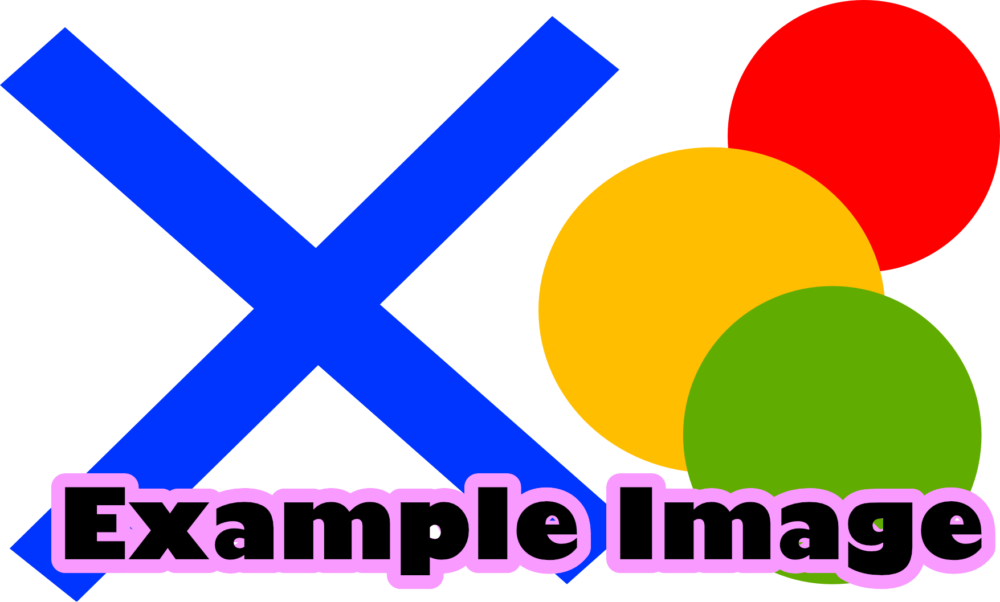

## Einleitung
Die Wahl der richtigen Game-Engine spielt eine entscheidende Rolle bei der Entwicklung von Computerspielen und beeinflusst sowohl die Effizienz des Arbeitsprozesses als auch die Qualität des Endprodukts. In diesem Bericht untersuchen wir drei der bekanntesten und am weitesten verbreiteten Game-Engines: Godot, Unreal Engine und Unity. Durch eine detaillierte Analyse möchten wir ihre Eigenschaften sowie die dazugehörigen Stärken und Schwächen aufzeigen, um Entwicklern und Interessenten eine fundierte Entscheidungsgrundlage zu bieten.
   
### Ziel der Analyse
Die Analyse konzentriert sich auf zentrale Aspekte wie Benutzerfreundlichkeit, technische Leistungsfähigkeit, Tool-Unterstützung und die Entwicklungsumgebung. Darüber hinaus spielt die Eignung der Engines für bestimmte Projekte – wie zum Beispiel das Entwickeln von Spielen, Simulationen, Software etc. – eine wesentliche Rolle. Neben der theoretischen Bewertung stellen wir daher auch praktische Erfahrungen vor, um einen praxisnahen Einblick in die Stärken und Schwächen der Engines zu geben. Unsere Ergebnisse sollen sowohl für professionelle Entwicklerteams als auch für Einzelpersonen nützlich sein, die sich in der Planung oder Umsetzung ihrer Projekte befinden. Durch die Ergebnisse unserer Arbeiten, möchten wir nicht nur technische Unterschiede aufzeigen, sondern auch Empfehlungen geben, welche Engine sich für spezifische Anwendungen und Anforderungen besonders eignet. Ziel ist es, einen umfassenden und zugleich verständlichen Überblick zu bieten, der eine informierte Entscheidung ermöglicht.

### Methodik
Um die Leistungsfähigkeit und Benutzerfreundlichkeit verschiedener Game Engines zu analysieren, haben wir zwei verschiedene Verfahren angewendet. Dieses umfasst sowohl objektive, messbare Tests als auch subjektive Erfahrungsberichte, die während der Entwicklung eines Beispielprojekts gewonnen wurden. Ziel ist es, die Stärken und Schwächen der Engines zu evaluieren und eine fundierte Grundlage für Empfehlungen bereitzustellen.

- Objektive Tests nach Kategorien

	**Physik-Benchmark:**
		Ein rechteckiges Becken (20 × 20 Meter) wird kontinuierlich mit Kugeln gefüllt, die pro Sekunde nacheinander instanziiert werden. Die Simulation wird beendet, sobald die Frame-Time (Delta) 100 ms überschreitet, was einer Framerate von ≤ 10 FPS entspricht. Das Messergebnis gibt an, wie viele Kugeln instanziiert werden konnten, bevor die Leistungsgrenze erreicht wurde.

	- Szenenaufbau:
        - Beckenabmessungen: 20 × 20 Meter.
        - Kugelradius: 0,05 Meter (Durchmesser: 0,1 Meter).
        - Kameraposition: Senkrecht über dem Becken zentriert.
        - Kamera-Öffnungswinkel: 60°.
        - Kameraabstand: So gewählt, dass das Becken den oberen und unteren Bildschirmrand vollständig ausfüllt.

	**Grafik-Benchmark:**
		Zur Überprüfung der Grafikleistung wird ein Turm aus Blöcken schrittweise aufgebaut. Dabei wird in jeder Iteration das Grid um eine Spalte und eine Reihe vergrößert, wodurch die Gesamtanzahl der Blöcke exponentiell ansteigt. Eine Kamera, die um den Mittelpunkt des Turms rotiert, stellt sicher, dass möglichst viele Flächen gerendert werden. Der Test endet, wenn die Frame-Time 100 ms überschreitet. Das Messergebnis gibt an, wie groß der Turm (in Blockanzahl) wird, bevor die Leistungsgrenze erreicht wird.

    - Szenenaufbau:
        - Die Kamera bleibt zentriert auf den Turm ausgerichtet und rotiert um diesen herum.
        - Turm wird pro Iteration um eine Spalte und Reihe vergrößert

- Entwicklung eines Beispielprojekts: Endless Runner

    Neben den Benchmarks wurde ein Endless-Runner-Spiel entwickelt, um die Engines unter praxisnahen Bedingungen zu testen. Das Projekt umfasst wesentliche Spielelemente wie prozedural generierte Levelabschnitte und verschiedene Gameplay Mechaniken wie Laufen und Springen

    Die Entwicklung des Projekts diente dazu, qualitative Eindrücke über die Benutzerfreundlichkeit, die Arbeitsabläufe und die Lernkurve der jeweiligen Engines zu sammeln. Aspekte wie die Zugänglichkeit der Dokumentation, die Effizienz der Entwicklungsumgebung und die Eignung der Engines für ein prozedurales Spiel wurden hierbei bewertet.

- Kombination qualitativer und quantitativer Analyse

    Die gewonnenen Ergebnisse aus den Benchmarks und der Entwicklung des Endless Runners wurden miteinander kombiniert, um eine ganzheitliche Bewertung zu ermöglichen. Damit konnten sowohl die technische Leitungs, als auch die praktischen Vor- und Nachteile geschickt erfasst werden.

    Mit diesem Verfahren wird sicher gesellt, dass die Analyse sowohl fundierte, datenbasierte Einblicke bietet, als auch die Erfahrungen der Teams und der tatsächlichen Entwicklung berücksichtigt.

## Unity

### Die Engine
- Lizenzmodell

    Unity bietet verschiedene Lizenzmodelle an, darunter kostenlose und kostenpflichtige Versionen. Eine Runtime-Gebühr wurde angekündigt, jedoch nach massiven Beschwerden der Community wieder verworfen.
         
    Zum Einen gibt es die "Personal"-Version, also die kostenfreie Version. Diese ist Ideal für Einsteiger, da selbst kein Geld investiert werden muss und trotz allem die grundlegenden Funktionen wie Echtzeit-Entwicklung, Startbildschirm-Anpassung und der Unity Asset Manager verfügbar sind.

    Die Pro-Version ist ab 1.877€ im Jahr erhältlich und eignet sich für profesionelle Entwickler. Es werden zusätzliche Features wie ein erweiterter LZS-Support und ein größerer Asset Manager angeboten.

    "Enterprise" ist auf große Teams und Firmen ausgerichtet. Diese Version umfasst Pro-Features und zusätzliche Optionen wie Build-Server-Lizenzen und einen vollen Zugriff auf den Quellcode. 

    Bei der Industry-Lizenz ist der Fokus auf Unternehmen in spezifischen Branchen gelegt und es werden Branchenspezifische Toolkits angeboten. 
	
	Als referenz werden Screenshots eingefügt, um einen genaueren Vergleich zu ermöglichen.
     
     

- Verbreitung

    Unity ist vor allem für 2D- und VR-Anwendungen weit verbreitet. Dank einer starken Community bietet die Engine zahlreiche Ressourcen:
    
    Eine Gute Code-Dokumentation über das [Unity Manual](https://docs.unity3d.com/Manual/index.html), einen unkomplizierten Einstieg mit Hilfe von [Unity Learn](https://learn.unity.com/) und eine sehr gute Community Hilfe über Youtube, Reddit und andere Platformen. Zudem kann Unterstützung in Foren ([Unity Discussion](https://discussions.unity.com/)) und Plattformen wie Reddit und Youtube aufgesucht werden.

### Benutzerfreundlichkeit, Usability
Die Benutzeroberfläche ist übersichtlich und intuitiv, auch wenn die Vielzahl der Funktionen anfangs überwältigend wirken kann.

Tutorials erleichtern den Einstieg enorm, z. B. beim Partikelsystem: Mit Anleitung war es einfach z. B. ein explodierendes Fass zu erstellen. Ohne ein Tutorial wäre dies aufgrund der Funktionsvielfalt anspruchsvoller gewesen.

Insgesamt beeindruckt Unity durch die Flexibilität und Anpassungsfähigkeit, die jedoch mit einer steileren Lernkurve verbunden ist.
### Programmierumgebung, Tools
Unity verwendet C# als Programmiersprache und unterstützt gängige IDEs wie Visual Studio, Visual Studio Code und Rider. Auch Debugging und Profiling ist mit den integrierten Tools realisierbar, die detaillierte Analysen, wie z.B. die Nutzung des Profilers zur Überprüfung der Frame-Time, ermöglichen.
    
Zudem wird Visual Scripting unterstützt, jedoch ist dieses weniger verbreitet.

### Grafikqualität
Die Grafikqualität ist stark von den eingesetzten Renderpipelines (URP, HDRP oder Built-in) abhängig. Besonders bei prozedural generierten Levels, wie im Endless Runner, konnte Unity mit flüssigen Übergängen und guter Darstellung überzeugen.

### Character Animation
Unity bietet einen leistungsstarken Animator mit einer State-Maschine, die Übergänge zwischen Animationen steuert. Zudem können Übergangszeiten und Bedingungen einfach angepasst werden.
- Mixamo zu Unity Problem:
Wir haben festgestellt, dass Mixamo keinen direkten Export von Animationen erlaubt. Die Lösung zu diesem Problem war dann, dass die Animationen aus dem Import extrahiert werden mussten, damit sie im Animator verwendet werden können.
- Ragdoll-System:
    Die Erstellung von Ragdolls ist komplex, da keine automatische Erkennung der Bones erfolgt. Zudem gibt es keine einfache Möglichkeit, zwischen Animation und Ragdoll zu wechseln, da Ragdolls nur aktiviert werden können, solange der Animation Controller nicht verwendet wird. Das Problem konnte mit einem Ragdoll-Enabler-Skript basierend auf diesem (siehe [YouTube-Tutorial](https://www.youtube.com/watch?v=RB18IyKZiB0)) gelöst werden.
### Lernkurve
Der Einstieg in Unity ist dank umfassender Ressourcen wie Unity Learn und der großen Community relativ einfach. Für spezifische Themen wie das Partikelsystem oder Animationen können jedoch zusätzliche Tutorials notwendig sein. 

Insgesamt bietet Unity eine moderate Lernkurve mit viel Unterstützung, allerdings erfordert die Vielzahl der Funktionen eine Einarbeitungszeit.
### Probleme & Lösungen, Eigenheiten
- Import von 3D-Modellen:
    Beim Import von 3D-Modellen traten Probleme auf, insbesondere beim Importieren von .blend-Dateien ohne installiertes Blender. Zudem war das manuelle Extrahieren und Zuweisen von Texturen erforderlich. Eine effektive Lösung bestand darin, stattdessen .fbx-Dateien zu verwenden, um den Workflow reibungsloser zu gestalten.

- Ragdolls:
    Im Bereich der Ragdolls zeigte sich, dass die automatische Erkennung von Bones nicht zuverlässig funktioniert, was ein manuelles Setup notwendig machte. Außerdem ist der Übergang von Animationen zu Ragdoll-Physik nicht nativ möglich. Dieses Problem konnte jedoch durch den Einsatz eines Ragdoll-Enabler-Skripts behoben werden.

- Mixamo-Animationen:
    Bei der Arbeit mit Mixamo-Animationen stellte sich der Export mehrerer Animationen als problematisch heraus. Die Lösung bestand darin, die Animationen manuell zu extrahieren und sie anschließend in den Animation Controller einzubinden.

### Gesamteindruck
Die Engine bietet eine Vielzahl an Tools und Funktionen, die jedoch mit einer gewissen Komplexität einhergehen. Besonders hervorzuheben sind die engagierte Community und die gute Dokumentation, die den Einstieg und die Fehlerbehebung erleichtern. Für den Endless Runner hat sich Unity als eine geeignete Wahl erwiesen, da die Engine sowohl prozedurale Levelgenerierung als auch komplexe Animationen gut unterstützt. Trotz kleinerer Eigenheiten und Herausforderungen ist Unity eine vielseitige und leistungsstarke Engine, die sich sowohl für Anfänger als auch für erfahrene Entwickler eignet.

## Unreal

### Die Engine
Die Unreal Engine 5 (UE5) von Epic Games ist eine der leistungsstärksten 3D-Entwicklungsplattformen. Sie glänzt besonders durch High-End-Grafik, ermöglicht durch Nanite (virtuelle Geometrie) und Lumen (Echtzeit-Global-Illumination). Die Engine ist bis zu einem Jahresumsatz von einer Million US-Dollar kostenfrei nutzbar; darüber hinaus fällt eine Umsatzbeteiligung von fünf Prozent an. Dies ist für kleine und mittlere Projekte attraktiv, kann jedoch für umsatzstarke Produktionen schnell teuer werden.

### Benutzerfreundlichkeit, Usability
Unreal Engine 5 bietet eine moderne Oberfläche und vielfältige Funktionen, setzt für effizientes Arbeiten jedoch eine leistungsfähige Hardware voraus. Einsteiger finden die Fülle an Einstellungen anfangs oft verwirrend. Viele Funktionen sind tief verschachtelt, weshalb man sich intensiver einarbeiten muss als etwa in Unity oder Godot. Unser Team stieß zum Beispiel auf Konfigurationshürden bei Material-Instanzen und den Projekteinstellungen. Mit offiziellen Tutorials und Dokumentationen ließen sich diese jedoch lösen.

Für das Endless-Runner-Projekt haben wir uns hauptsächlich auf Blueprints konzentriert, da diese eine schnelle Umsetzung ermöglichen, ohne direkt in den Code eingreifen zu müssen. Trotz der Vorteile können Blueprints in komplexen Projekten schnell unübersichtlich werden, weshalb eine saubere Strukturierung und Namenskonventionen besonders wichtig sind.

### Programmierumgebung, Tools
Unreal Engine bietet zwei Hauptwege zur Entwicklung von Gameplay:
- **Blueprints**: Ein visuelles Scripting-System, das schnelle Prototypen ohne tiefere Programmierkenntnisse erlaubt.
- **C++**: Für komplexe oder besonders performante Anwendungen wird C++ eingesetzt, das allerdings anspruchsvoller ist.

Der Editor unterstützt Hot Reload, sodass Codeänderungen in vielen Fällen ohne Neustart übernommen werden können. In unserem Projekt zeigten sich hierbei jedoch gelegentliche Fehler, die teils einen Editor-Neustart erforderten.

Für Tests und Benchmarks erwies sich die Einrichtung teils als aufwändig. Beispielsweise verlangte das ständige Instantiieren und Verwalten von Objekten in Echtzeit (z. B. für einen Physik-Benchmark) ein tieferes Verständnis von Actor-Klassen und Kollisionskanälen.

### Grafikqualität
Die Grafikfunktionen der Unreal Engine 5 gehören zu den modernsten im Markt:
- **Nanite**: Eignet sich für extrem detaillierte Meshes, die ohne manuelles LOD-Handling gerendert werden können.
- **Lumen**: Bietet dynamische globale Beleuchtung, wodurch Szenen realistisch wirken.

Für unseren Endless-Runner, der keine fotorealistischen Assets nutzte, waren diese Features teils überdimensioniert. Wer jedoch hohen Wert auf realitätsnahe 3D-Umgebungen legt, wird mit Unreal Engine 5 hervorragend bedient.

In unserem Endless Runner war die Grafik zwar eher schlicht gehalten, aber wir konnten einige interessante Shader-Effekte umsetzen. Besonders das "Curved World"-Feature, bei dem die Spielwelt optisch gekrümmt wird, war ein spannendes Experiment mit dem Material-Editor. Durch die Nutzung einer Material Parameter Collection (MPC) konnten wir verschiedene Parameter wie Krümmungsradius und Intensität anpassen, was zu einem einzigartigen Look führte.

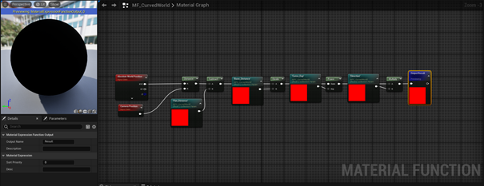
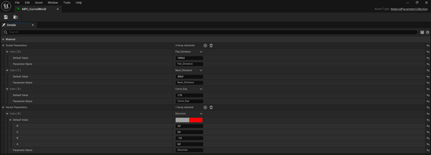

### Character Animation
Die Engine verfügt über komplexe Animationswerkzeuge, darunter Animation Blueprints, State Machines und Retargeting. Dadurch können Animationen von unterschiedlichen Skeletten übernommen werden. 
Für die Charakteranimation wurde ein Modell von Mixamo genutzt. Mixamo bietet eine große Auswahl an vorgefertigten Animationen, die sich leicht in Unreal importieren lassen. Allerdings gab es einige Schwierigkeiten beim Retargeting der Animationen, da die Skelettstrukturen von Mixamo nicht 1:1 mit dem Unreal-Standard-Mannequin übereinstimmen.
Um dieses Problem zu lösen, mussten wir eine Retargeting-Session innerhalb von Unreal durchführen, in der die Knochen korrekt zugeordnet wurden. Danach konnten wir die Lauf-, Sprung- und Rutschanimationen problemlos in unser Spiel integrieren. Besonders das Sliding-Feature war eine Herausforderung, da die Kapsel-Kollision des Charakters angepasst werden musste, um das Untergleiten von Hindernissen zu ermöglichen.

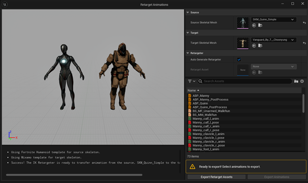
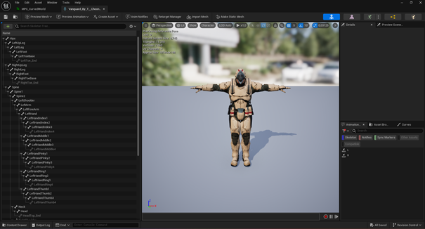

### Lernkurve
Unreal Engine 5 erfordert eine steile Einarbeitung. Blueprints sind ein schneller Einstieg für Prototypen, doch für umfassende Projekte ist fundiertes C++-Wissen ratsam. Wer aus anderen Engines kommt, muss sich zudem auf das komplexe Projekt-Setup und die Editor-Struktur einstellen. Dennoch gibt es eine große Menge an Lernmaterial: Offizielle Dokumentation, Community-Foren, YouTube-Kanäle und kostenpflichtige Kurse helfen beim Einstieg.

### Probleme & Lösungen, Eigenheiten

#### Fehlender Web-Export
In älteren Versionen gab es einen offiziellen Web-Export. Mit UE4 wurde er eingestellt, was Entwicklern nur noch die Option ließ, „Pixel Streaming“ oder externe Lösungen zu nutzen. In UE5 fehlt diese Option vollständig. Das Fehlen des Web-Exports ist für viele Projekte ein Nachteil, wenn Browser-Unterstützung benötigt wird.

#### Implementierung der Benchmarks
Unsere Benchmarks sollten Framezeiten, Objektinstanzierungen und andere Metriken erfassen. Ein Problem war die fehlende Möglichkeit, umfangreiche Daten direkt in eine Konsole oder Log-Datei auszugeben, sobald das Projekt exportiert ist. Stattdessen stellt Unreal On-Screen-Statistiken und hauseigene Logs bereit, die für automatisierte Testverfahren aber nur bedingt geeignet sind.

#### Kameramanagement
Die Kamera in Unreal Engine 5 ist an einen Player-Controller geknüpft. Eine statische oder frei rotierende Kamera ließ sich nur schwer ohne zusätzliche Keyframe-Animationen realisieren. Da wir Benchmarks in Echtzeit ausführen wollten, benötigten wir jedoch eine feste Kameraperspektive. Cine Cameras sind zwar mächtig, aber eher für vorgerenderte Sequenzen ausgelegt, was automatisierte Tests erschwerte.

#### Physik-Benchmarks
Für unseren Physik-Benchmark waren mehrere Projekteinstellungen nötig. Kollisionskanäle, Sub-Level-Strukturen und Physikprofile gestalteten sich komplexer als erwartet.

#### UAssets und Versionskontrolle
Weil Unreal Assets in binären Dateien (UAssets) gespeichert werden, können Merge-Konflikte in Git oder anderen Versionskontrollen schwer zu lösen sein. Um dies zu vermeiden, braucht es sorgfältige Arbeitsabläufe und die Aufteilung der Projektbereiche.

#### Herausforderungen: Endless Runner
Bei der Entwicklung des Spiels kam es zu Herausforderungen, sei es durch die Mechanik/Physik, der Grafischendarstellung oder auch die Kamera Einstellungen.

Ein Beispiel für eine Herausforderung war die Optimierung des Straßen-Spawn-Systems. Ursprünglich wurden zu viele Straßenabschnitte gleichzeitig geladen, was zu Performance-Problemen führte. Die Lösung war die Implementierung eines Kollisionstriggers: Sobald der Spieler eine neue Plattform betritt, wird eine neue Straße generiert und die alte gelöscht. Dies sorgte für eine effiziente Verwaltung der Level-Elemente.

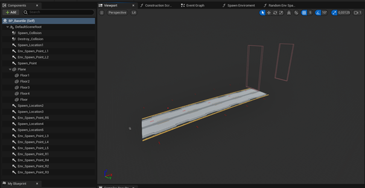
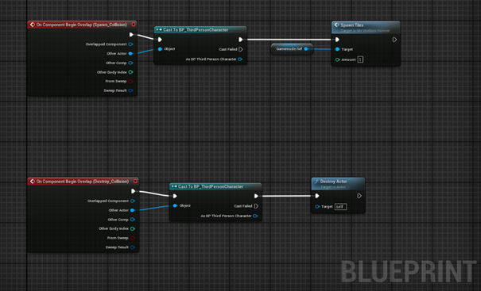

Ein weiteres Problem trat bei der Rutschmechanik auf. In der ersten Version konnte der Charakter zwar eine Slide-Animation ausführen, aber die Kollision verhinderte das tatsächliche Durchrutschen unter Hindernissen. Hier mussten wir die Kapsel-Kollision des Charakters dynamisch anpassen und nach der Animation wieder auf die Standardgröße zurücksetzen.

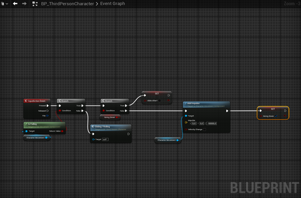
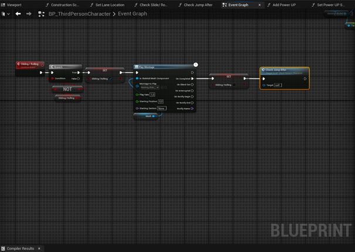

Ein zusätzliches Problem war die Kameraeinstellung. Die Kamera sollte den Charakter flüssig verfolgen, ohne dass abrupte Bewegungen auftreten. Dafür wurde ein Kamera-Blueprint erstellt, der die Bewegung interpoliert und sich dynamisch an den Spurwechsel anpasst.

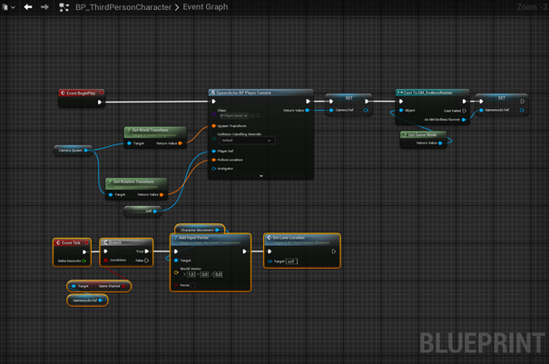

Das Power-Up-System wurde so integriert, dass der Spieler temporäre Vorteile wie einen Magnet-Effekt oder höhere Sprünge erhalten kann. Die Power-Ups erscheinen zufällig in der Spielwelt und werden über ein Widget im HUD angezeigt.

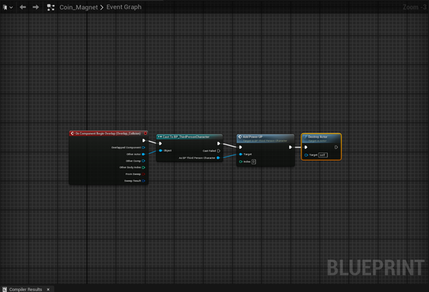
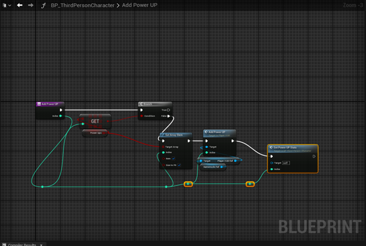

Der gespeicherte Highscore wird in einer Datei im Slot „SaveGame“ abgelegt, sodass die besten Punktestände erhalten bleiben. Dies ermöglicht es, die Punktzahlen auch nach einem Spielende wieder abzurufen.

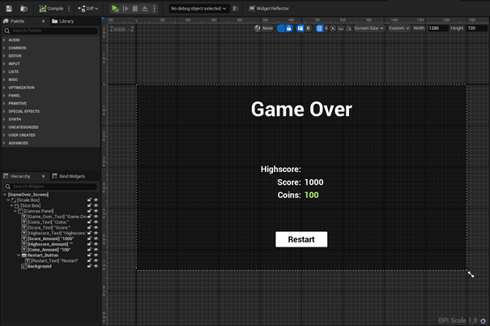
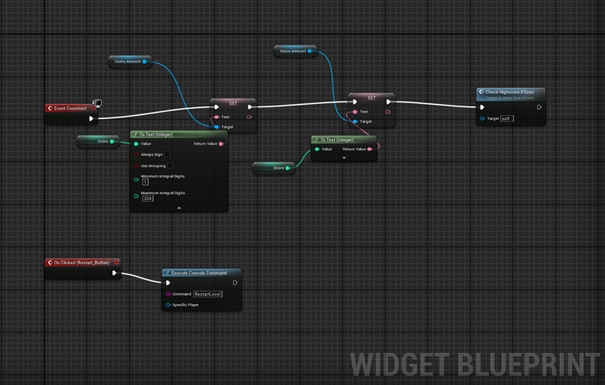

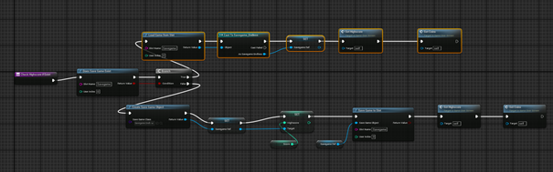
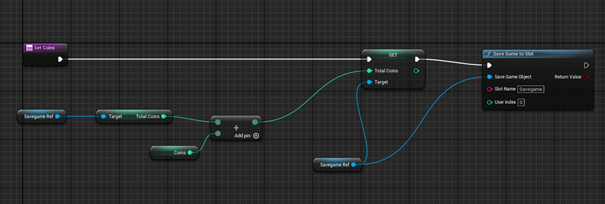

### Gesamteindruck
Unreal Engine 5 zählt zu den leistungsfähigsten Engines für hochwertige 3D-Projekte und bietet dank Nanite und Lumen Top-Grafik. Sie ist ideal für ambitionierte Spieleentwicklungen oder interaktive Echtzeitvisualisierungen, wenn genügend Hardwareressourcen verfügbar sind. Allerdings ist die Einstiegshürde hoch, und das Fehlen einer aktuellen Web-Export-Lösung kann sich für bestimmte Projekte als kritisch erweisen.

Die Entwicklung eines Endless Runners mit Unreal Engine war eine spannende Erfahrung, die uns viele Einblicke in die Funktionsweise der Engine gegeben hat. Besonders positiv ist die Flexibilität der Engine: Dank Blueprints konnten wir viele Mechaniken schnell umsetzen, ohne tief in C++ einsteigen zu müssen. Die Grafikqualität und die verfügbaren Tools sind auf einem sehr hohen Niveau, was Unreal zu einer idealen Wahl für ambitionierte Projekte macht.

Für rein 2D-basierte Spiele oder extrem einfache Prototypen wirkt Unreal oft überdimensioniert. Dort sind andere Engines (z. B. Godot oder Unity) meist schneller eingerichtet. Wer jedoch an AAA-Qualität oder großen Projekten interessiert ist, findet in UE5 eine mächtige, wenn auch komplexe Entwicklungsumgebung.

Insgesamt sind wir sehr zufrieden mit dem Endergebnis. Der Endless Runner funktioniert stabil, und wir konnten viele interessante Features wie zufällige Hindernis-Generierung, Power-Ups und ein Highscore-System implementieren. Unreal Engine hat sich als leistungsfähige und vielseitige Entwicklungsplattform erwiesen.

## Godot

### Die Engine
Die Godot Engine, welches 2014 veröffentlicht wurde, ist eine MIT - lizensierte Open-Source Engine. Die MIT-Lizenz erlaubt es die Software frei zu nutzen, zu modifizieren und zu verteilen, solange der ursprüngliche Lizenztext beibehalten wird. Sie bietet zudem keinen Haftungsausschluss für Schäden. Godot wird von einer aktiven Community sowie einem Kernteam kontinuierlich weiterentwickelt. Godot unterstützt sowohl 2D- als auch 3D-Spieleentwicklung, wobei der Fokus besonders auf der 2D- Performance liegt, allerdings gab es bereits schon wesentliche Fortschritte im 3D - Bereich. Die Engine bietet eine umfassende Plattformunterstützung und erlaubt die Veröffentlichung von Spielen auf Windows, macOS, Linux, Android, iOS und Konsolen. Ein Alleinstellungsmerkmal von Godot ist das integrierte Szenensystem, das Spielelemente hierarchisch organisiert und den Entwicklungsprozess stark vereinfacht.

### Benutzerfreundlichkeit, Usability
Godot zeichnet sich durch eine intuitive Benutzeroberfläche und ein klar strukturiertes Layout aus, das sowohl für Einsteiger als auch für erfahrene Entwickler leicht verständlich ist. Besonders die Drag- and-Drop-Funktionalität und der Node-basierte Aufbau tragen dazu bei, dass die Engine schnell erlernt werden kann. Tutorials und Dokumentationen sind gut verfügbar, wobei die Community eine Vielzahl zusätzlicher Ressourcen bereitstellt. Ein Nachteil könnte jedoch die kleinere Community im Vergleich zu Unity oder Unreal darstellen, was die Verfügbarkeit spezifischer Plugins oder Lösungen einschränken könnte. 

### Programmierumgebung, Tools
Die Programmierung in Godot erfolgt primär mit der hauseigenen Skriptsprache GDScript, die Python-ähnlich ist und sich durch ihre Einfachheit und Lesbarkeit auszeichnet. Alternativ unterstützt Godot auch C# und externe Skriptsprachen. Die integrierte Entwicklungsumgebung (IDE) bietet viele hilfreiche Funktionen wie einen eingebauten Code-Editor, Debugging-Tools und ein Live-Update-System, mit dem Änderungen sofort getestet werden können. Besonders hervorzuheben ist die Modularität der Engine: Entwickler können problemlos eigene Plugins und Erweiterungen integrieren, um den Entwicklungsprozess weiter zu optimieren. Dabei zu beachten, ist, dass nicht alle Plugins auf den neusten Stand gehalten werden, da viele von ihnen kostenlos angeboten werden und es auf eine freiwillige Tätigkeit basiert und der finanzielle Anreiz fehlt. Zusätzlich kann man die Engine modifizieren mithilfe von C++.

### Grafikqualität
Mit der Einführung des Vulkan-Renderers in Version 4.3 hat Godot erhebliche Fortschritte erzielt. Vulkan ermöglicht moderne Rendering-Technologien wie realistische Lichteffekte, dynamische Schatten, High Dynamic Range (HDR), Global Illumination und Screen-Space Reflections, die die visuelle Darstellung deutlich verbessern. Dennoch wurden in einigen Fällen Performance-Einbußen festgestellt, insbesondere bei der Verwendung von OmniLight3D-Schatten, was auf eine erhöhte Anzahl von Draw Calls zurückzuführen ist. 

### Character Animation
Godot bietet umfangreiche Tools für Animationen, darunter den AnimationPlayer und den AnimationTree, die komplexe Animationsabläufe ermöglichen. Skeletale Animationen lassen sich einfach importieren und bearbeiten. Mit Blend Spaces und State Machines können fließende Übergänge zwischen Animationen realisiert werden. Dennoch wurden in der Community Performance-Probleme bei Animationen diskutiert, insbesondere im Vergleich zu anderen Engines. Allerdings kam es in unserem Projekt nicht zu Performance Problemen bezüglich der Animationen.

### Lernkurve
Godot zeichnet sich durch eine intuitive Benutzeroberfläche und ein flexibles Node-basiertes System aus, was besonders für Einsteiger den Einstieg erleichtert. Die Skriptsprache GDScript, die Python-ähnlich ist, ermöglicht einen einfachen und schnellen Start in die Spieleentwicklung. Alternativ bietet Godot Unterstützung für C#. Die umfangreiche Dokumentation und eine aktive Community bieten zusätzliche Hilfestellung. Der Umstieg von anderen Engines kann jedoch aufgrund der einzigartigen Konzepte von Godot anfangs herausfordernd sein. Es ist wichtig zu beachten, dass Visual Scripting in Godot 4 entfernt wurde, da es wenig genutzt wurde und der Wartungsaufwand hoch war. Es gibt jedoch Community-Plugins wie "Orchestrator", die ähnliche Funktionalitäten bereitstellen. 

### Probleme & Lösungen, Eigenheiten
Ein bekanntes Problem der Godot Engine betrifft die Physics Engine, insbesondere im 3D-Bereich. Die Kollisionserkennung und die Physikberechnungen sind nicht immer präzise, was oft zusätzliche Optimierungen erfordert. Auch der Asset-Import, vor allem aus Blender, kann problematisch sein, insbesondere bei Materialien und Texturen. Bei der Shader - Programmierung gab es Performance - Probleme. Diese wurden durch Anpassungen an den Einstellungen in der Godot Engine selbst und der Nodes behoben.

### Gesamteindruck
Die Godot Engine 4.3 ist eine Open-Source-Spielentwicklungsumgebung, die sowohl 2D- als auch 3D-Spielentwicklung unterstützt. Sie wird unter der MIT-Lizenz vertrieben, was Entwicklern maximale Freiheit bietet, den Code anzupassen und zu verteilen. Godot hat eine wachsende Community und ist besonders bei Indie-Entwicklern beliebt, da es kostenlos und leicht zugänglich ist. 

Die Engine ist bekannt für ihre benutzerfreundliche Oberfläche und das Node-basierte System, das die Strukturierung von Projekten erleichtert. Godot bietet eine integrierte Entwicklungsumgebung (IDE) mit einem umfassenden Toolset, einschließlich eines visuellen Editors und einer relativ einfach zu verstehenden Script-Sprache namens GDScript, die besonders gut auf die Engine angepasst ist. Es unterstützt auch C# und C++. 

Die Grafikqualität in 3D scheint akzeptabel zu sein, jedoch konnten wir in diesem Projekt nicht tief darauf eingehen. Animationen lassen sich einfach importieren und bearbeiten. Die Engine verfügt über integrierte Tools wie den AnimationPlayer, um Animationen direkt in der Engine zu erstellen. Die Lernkurve ist moderat. Für Anfänger gibt es viele Tutorials und eine aktive Community, die Unterstützung bietet. 

Es gibt einige Herausforderungen, insbesondere mit der Physics Engine von Godot 4.3. In unserem Fall, bei der Entwicklung eines kleinen 3D-Spiels, stellte sich heraus, dass die Physics Engine nicht besonders akkurat und performant ist. Diese Schwierigkeiten erforderten zusätzliche Anpassungen und Optimierungen, um die gewünschte Funktionalität zu erreichen. Insgesamt bietet die Godot Engine 4.3 jedoch eine robuste und vielseitige Plattform für Spieleentwickler, die bereit sind, sich in die Engine einzuarbeiten und individuelle Lösungen für spezifische Herausforderungen zu finden. 

## Vergleich von Unreal Engine, Unity und Godot

Im Folgenden finden sich die wichtigsten Eckdaten zu den drei Engines in tabellarischer Form. Die Angaben zur **Performance** basieren auf Beispiel-Benchmarks (Rendering/Physik) in einer Testumgebung mit folgendem System:

- **CPU:** 12th Gen Intel(R) Core(TM) i9-12900H, 2,90 GHz (14 Kerne / 20 Threads)  
- **RAM:** 32 GB  
- **GPU:** NVIDIA GeForce RTX 3080 Ti Laptop GPU (16 GB VRAM)  
- **Auflösung:** 2560 × 1600  

### Performance und Physik-Evaluation
Die Ergebnisse wurden anhand von Rendering-Benchmarks (Anzahl darstellbarer Objekte, bevor die Framerate unter 10 FPS fällt) und Physik-Benchmarks (instanziierte Kugeln oder Blöcke bis zum Erreichen einer kritischen Frame-Time von 100 ms) ermittelt.

| **Kategorie**               | **Unreal Engine**                                                              | **Unity**                                                                             | **Godot**                                                                                      |
|-----------------------------|--------------------------------------------------------------------------------|----------------------------------------------------------------------------------------|------------------------------------------------------------------------------------------------|
| **Lizenzmodell**            | Kostenfrei bis 1 Mio. USD Umsatz, dann 5 % Umsatzbeteiligung                  | Personal (kostenlos), Pro ab 1.877 €/Jahr; Enterprise für große Teams                  | Open Source (MIT), kostenfrei                                                                  |
| **Unterstützte Plattformen**| PC, Konsolen, VR/AR (kein offizieller Web-Export seit UE4/UE5)                | PC, Konsolen, Mobile, VR/AR, Web (HTML5)                                              | PC, Mobile, Konsolen, Web (HTML5 per Export)                                                   |
| **Rendering-Benchmark**     | Keine Daten vorhanden          | Layer 139: ca. 1.113.390 Blöcke, Frame Time ~102 ms                                    | Objektanzahl 203.275; im Frame ~101.024 Objekte                                               |
| **Physik-Benchmark**        | Keine Daten vorhanden          | 11.584 Kugeln, danach Frame Time ≥100 ms                                               | 8.757 Instanzen, davon 1.502 aktive 3D-Physikobjekte                                           |
| **Community & Ressourcen**  | Große AAA-Community, sehr aktive Foren, Blueprint + C++-Support               | Sehr verbreitet, riesiger Asset Store, unzählige Tutorials (YouTube, Foren etc.)       | Wachsende Community, gute Dokumentation, jedoch weniger Plugins/Assets als Unity/Unreal        |
| **Grafik-Funktionen**       | High-End-Features (Nanite, Lumen), hohe Hardware-Anforderungen                | Versch. Render-Pipelines (URP, HDRP, Built-In), skalierbar, eher moderater Bedarf      | Vulkan ab Godot 4.x, weitere Optimierungen in Arbeit, 3D-Funktionalität wird ständig verbessert |
| **Einsatzbereich**          | AAA / High-End-3D-Projekte, aufwendige visuelle Umsetzungen, steile Lernkurve | Sehr flexibel (2D, 3D, VR), eignet sich für Indie bis AA/AAA, relativ zugänglicher Einstieg | Besonders stark in 2D und Prototyping, Open Source, für 3D weiterentwickelt, aber teils weniger performant |

**Hinweise zu den Messwerten**  
- Die **Rendering-Benchmarks** prüfen, wie viele Objekte (Blöcke, Meshes o. Ä.) gerendert werden können, bevor die Bildrate unter einen praxisrelevanten Grenzwert sinkt.  
- Die **Physik-Benchmarks** messen, wie viele Instanzen (z. B. Kugeln) erzeugt werden können, bevor die Frame-Time 100 ms (unter 10 FPS) überschreitet.  

## Fazit
   
### Stärken/Schwächen
Unity bietet eine große und aktive Community mit zahlreichen Hilfestellungen über YouTube, Reddit und andere Foren. Zudem gibt es viele Open-Source-Ressourcen sowie einen umfangreichen Asset Store mit zahlreichen Inhalten. Die Engine ist äußerst flexibel und unterstützt eine Vielzahl von Plattformen und Betriebssystemen. Ihre umfangreichen Tools erleichtern die Entwicklung erheblich. Allerdings gestaltet sich die Implementierung von Ragdoll-Physik als komplex, und das UI-System gilt als umständlich.

Godot punktet durch seine Open-Source-Natur und die Tatsache, dass keine Lizenzgebühren anfallen. Die intuitive Oberfläche und das Node-basierte System ermöglichen eine benutzerfreundliche Projektstrukturierung. Die eigens für die Engine entwickelte Skriptsprache GDScript ist leicht verständlich und besonders für Entwickler mit Programmiererfahrung schnell erlernbar. Zudem bietet Godot eine breite Plattformunterstützung, eine integrierte Entwicklungsumgebung und sehr gute Dokumentation. Trotz dieser Vorteile weist die Engine einige Schwächen auf: Die Physics Engine kann in 3D-Projekten ungenau und leistungsschwach sein, was Optimierungen erfordert. Auch der Asset-Import, insbesondere von Blender-Modellen, kann problematisch sein. Zudem ist die Rendering-Leistung in aufwendigen 3D-Projekten nicht herausragend, und schlecht integrierte Plugins können zu Problemen führen.

Unreal Engine überzeugt mit herausragender Grafikqualität, dank moderner Technologien wie Nanite, Lumen und Echtzeit-Raytracing. Das Blueprint-System ermöglicht visuelle Programmierung, sodass auch Entwickler ohne tiefgehende C++-Kenntnisse komplexe Mechaniken erstellen können. Zudem ist die Engine Open Source, was individuelle Anpassungen erlaubt. Die Lizenzpolitik ist für kleinere Studios vorteilhaft, da erst ab einem Umsatz von einer Million Dollar Lizenzgebühren anfallen. Unreal unterstützt zahlreiche Plattformen, bietet eine starke Community und leistungsstarke Physik- sowie KI-Systeme. Allerdings erfordert die Engine leistungsfähige Hardware und hat eine steile Lernkurve, insbesondere für Anfänger. Die hohe Dateigröße und langen Ladezeiten können problematisch sein, ebenso wie die geringe Optimierung für 2D-Spiele. Zudem kann die Engine für kleine Projekte überdimensioniert sein, und Updates können bestehende Projekte beeinträchtigen. Das Lizenzmodell mit einer Umsatzbeteiligung von 5 % ist für erfolgreiche kommerzielle Spiele ein möglicher Nachteil.

#### Unity
- Stärken:
    - Gute Community mit vielen Hilfestellungen via YouTube, Reddit und anderen Foren
    - Viele Open Source Ressourcen
    - Eigener Asset Store mit viele Inhalten
    - Weitreichende Platformunterstützung
    - Flexibilität bei Betriebssystemen 
    - Umfangreiche Tools, die die Entwicklung vereinfachen
- Schwächen: 
    - Komplexe Ragdoll-Implementierung
    - UI System ist umständlich
 
      
#### Unreal Engine
##### Stärken
- **High-End-Grafik**  
  Durch Technologien wie Nanite und Lumen ermöglicht die Engine fotorealistische Darstellung und dynamische Beleuchtung für qualitativ hochwertige 3D-Projekte.
- **Blueprints & C++**  
  Mit dem visuellen Scripting-System (Blueprints) ist ein schneller Einstieg möglich. Wer mehr Leistung und Flexibilität benötigt, kann auf C++ umsteigen.
- **Umfangreiche Tools & Integration**  
  Eine breite Palette an Entwicklertools (z. B. Animation Blueprints, Visual Effects, KI) und die enge Verzahnung mit professionellen Film- und TV-Produktionspipelines machen Unreal vielseitig einsetzbar.
- **Große Community & AAA-Referenzen**  
  Dank zahlreicher Foren, Tutorials und Marketplace-Inhalte findet man schnell Lösungen, Beispielcode und Assets. Viele AAA-Studios setzen auf Unreal, was den Bekanntheitsgrad steigert.

##### Schwächen
- **Steile Lernkurve**  
  Die Engine ist sehr mächtig und umfangreich. Einsteiger müssen mit erheblicher Einarbeitungszeit rechnen, besonders bei der C++-Programmierung.
- **Hohe Systemanforderungen**  
  Um die Vorteile von Nanite und Lumen auszuschöpfen, wird eine leistungsfähige Hardware vorausgesetzt. Auch der Editor selbst gilt als ressourcenintensiv.
- **Kein offizieller Web-Export**  
  Anders als bei Unity oder Godot bietet Epic seit UE4/UE5 keine offizielle Möglichkeit mehr, Projekte direkt für das Web zu exportieren. Externe Lösungen wie Pixel Streaming bieten nur einen begrenzten Ersatz.
- **Binäre Asset-Dateien (UAssets)**  
  Diese können in Versionskontrollsystemen zu Konflikten führen, da Merge-Tools häufig nicht mit Binärdateien umgehen können. Für Teamprojekte erfordert das eine durchdachte Arbeitsorganisation.

#### Godot
##### Stärken 
- **Open-Source und kostenlos:** Keine Lizenzgebühren oder Einschränkungen bei der Nutzung.
- **Benutzerfreundlichkeit:** Intuitive Oberfläche und ein Node-basiertes System, das die Projektstrukturierung erleichtert.
- **GDScript:** Eine einfach zu erlernende Script-Sprache, die gut auf die Engine angepasst ist und für Entwickler mit Programmiererfahrung leicht verständlich ist.
- **Plattformübergreifend:** Unterstützung für zahlreiche Plattformen, einschließlich Windows, macOS, Linux, Android, iOS, HTML5 und mehr.
- **Integrierte Entwicklungsumgebung (IDE):** Umfassendes Toolset, einschließlich visueller Editor und Debugging-Tools.
- **2D- und 3D-Unterstützung:** Flexible Entwicklungsmöglichkeiten sowohl für 2D- als auch für 3D-Projekte.
- **Community und Support:** Eine aktive Community und zahlreiche Tutorials und Ressourcen, die den Einstieg erleichtern.
- **Dokumentation:** Sehr gute und auch offline verfügbare Dokumentation.
- **Anpassbarkeit:** Einfacher Zugang zum Quellcode ermöglicht tiefgreifende Anpassungen und Erweiterungen der Engine.
- **Plugins:** Vielzahl verfügbarer Plugins, die die Funktionalität der Engine erweitern können.

##### Schwächen 
- **Physics Engine:** In 3D-Projekten kann die Physics Engine ungenau und leistungsschwach sein, was zusätzliche Optimierungen erfordert.
- **Asset-Import:** Probleme beim Import von Blender-Assets und anderen Modellen, insbesondere im Hinblick auf Materialien und Texturen.
- **Rendering-Leistung:** In 3D-Projekten kann die Rendering-Leistung akzeptabel, aber nicht herausragend sein, was bei umfangreicheren Projekten zu Einschränkungen führen könnte.
- **Plugins:** Obwohl Plugins eine positive Erweiterung darstellen, können sie Probleme verursachen, wenn sie nicht sorgfältig integriert werden.

### Empfehlungen

- Auch Godot ist besonders stark in der 2D-Spieleentwicklung und bietet eine großartige Auswahl von Tools um Spiele effizient zu entwickeln. Zudem gibt es einen visuellen Editor, der die Arbeit mit Sprites und Animationen vereinfacht. Besonders hervorzuheben ist das Prototyping, das in Godot hervorragend realisiert werden kann. **-> Dieser Teil wurde von Gruppe 2 geschrieben. Soll dieser behalten werden oder soll der untere, der von der Godot Gruppe verfasst wurde, benutzt werden?**

#### Unity
- Unity kann besonders gut für 2D Spiele oder VR-Anwendungen empfohlen werden. Auch 3D-Entwicklungen sind möglich. Diese können aber bei grafisch anspruchsvollen Spielen nicht mit anderen Engines mithalten. Auch Erwähnenswert ist die starke Community, die mit verschiedensten Tools, Addons und Tutorials die Spieleentwicklung enorm erleichtern. Zudem ist Unity eine budgetfreundliche Option die zudem eine breite Plattformunterstützung bietet.
#### Unreal
##### Spieleentwicklung
- **High-End-3D-Spiele**: Die Unreal Engine ist besonders für groß angelegte 3D-Projekte mit fotorealistischer Grafik geeignet. Nanite (virtuelle Geometrie) und Lumen (dynamische globale Beleuchtung) sorgen für beeindruckende visuelle Ergebnisse und machen die Engine zum Favoriten bei AAA-Titeln.  
- **Prototyping größerer Projekte**: Dank Blueprints lassen sich Mechaniken rasch umsetzen, ohne tiefgreifende Programmierkenntnisse. Für komplexe, rechenintensive Funktionen bietet C++ zusätzliche Performance und Flexibilität.
##### Anwendungen und Tools
- **Architekturvisualisierung und Simulationen**: Unreal eignet sich hervorragend für interaktive Simulationen oder begehbare Architekturrundgänge. Die hohe Grafikqualität und vielseitigen Physik-Features ermöglichen detailgetreue, immersive Szenen.  
- **Film- und TV-Produktionen (Virtual Production)**: Die Engine hat sich im Bereich Virtual Production etabliert. Echtzeit-Rendering und Integration mit professionellem Filmequipment schaffen beeindruckende virtuelle Sets.
##### Lern- und Bildungstools
- **Blueprints als Einstieg**: Das visuelle Scripting-System erlaubt Einsteigern einen schnellen Zugang zu den Grundmechaniken, ohne sich zunächst in C++ einarbeiten zu müssen.  
- **Umfangreiche Ressourcen**: Offizielle Dokumentationen, Video-Tutorials und eine große Community bieten zahlreiche Lernmaterialien. Fortgeschrittene Themen wie Shader-Programmierung und Netzwerkfeatures werden ebenfalls detailliert behandelt.  
- **Community-Projekte**: Zahlreiche Indie-Projekte und GitHub-Repositories liefern praktische Beispiele, um verschiedene Genres und Anwendungsfälle zu erforschen.
#### Godot
##### Spieleentwicklung 
- **2D-Spiele:** Godot ist besonders stark in der 2D-Spieleentwicklung. Die Engine bietet eine Fülle von Tools, um 2D-Spiele effizient und effektiv zu erstellen, einschließlich eines visuellen Editors, der die Arbeit mit Sprites, Tilesets und Animationen erleichtert.
- **3D-Spiele:** Während Godot historisch eher auf 2D-Spiele fokussiert war, hat die 4.3-Version erhebliche Verbesserungen in der 3D-Entwicklung mit sich gebracht. Die Engine bietet nun bessere Rendering-Fähigkeiten, Shader-Unterstützung und eine Vielzahl von Tools, um 3D-Welten zu erschaffen.
- **Prototyping:** Durch die benutzerfreundliche Oberfläche und Skripting-Tools eignet sich Godot hervorragend für das schnelle Prototyping von Spielideen.

##### Anwendungen und Tools 
- **Interaktive Anwendungen:** Godot kann für die Entwicklung von interaktiven Anwendungen und Tools verwendet werden, die auf verschiedenen Plattformen laufen, einschließlich Desktop, Mobile und Web.

##### Lern- und Bildungstools 
- **Bildung und Lehre:** Godot ist aufgrund seiner Zugänglichkeit und der umfassenden Dokumentation eine großartige Wahl für Bildungseinrichtungen und Lernende, die in die Spielentwicklung einsteigen möchten. Die Engine bietet eine ideale Plattform, um grundlegende Konzepte der Programmierung und Spieleentwicklung zu erlernen.

## Anhang

#### Unreal:
1. [Unreal Engine 5 – Offizielle Dokumentation](https://docs.unrealengine.com/5.0/en-US/)  
2. [Unreal Engine Lizenzmodell](https://www.unrealengine.com/en-US/release)  
3. [Blueprint Visual Scripting](https://docs.unrealengine.com/5.0/en-US/blueprints-visual-scripting-in-unreal-engine/)  
4. [Nanite in Unreal Engine 5](https://docs.unrealengine.com/5.0/en-US/nanite-in-unreal-engine/)  
5. [Lumen in Unreal Engine 5](https://docs.unrealengine.com/5.0/en-US/lumen-in-unreal-engine/)  
6. [Pixel Streaming Informationen (Community Plugin)](https://docs.unrealengine.com/5.0/en-US/pixel-streaming-in-unreal-engine/)
